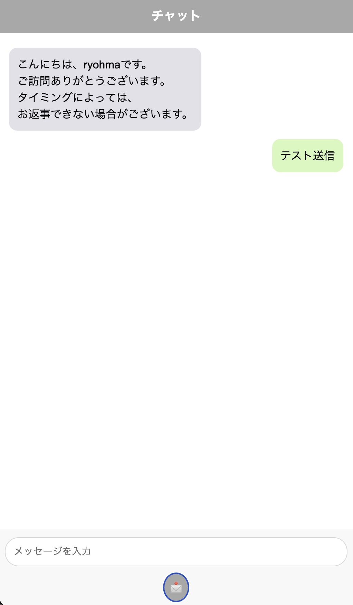
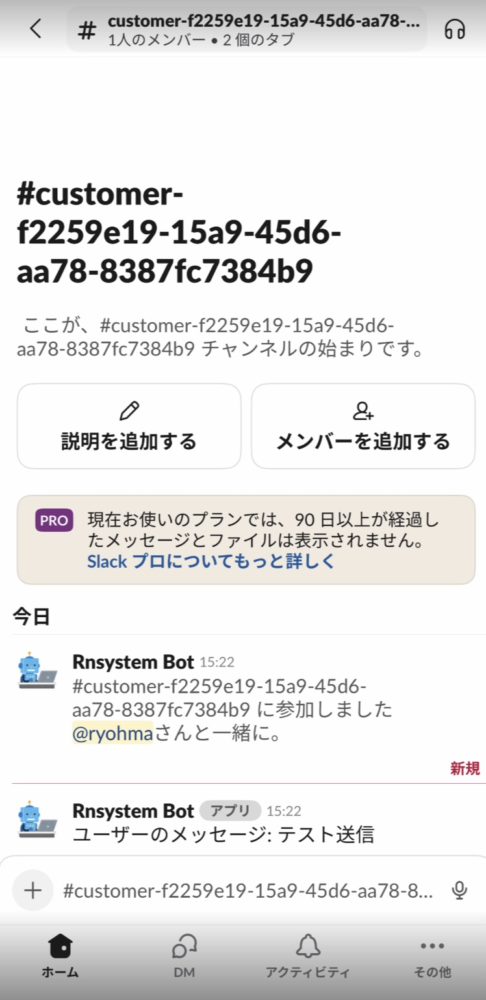

# Rnsystem Chat

---

Flask と Socket.IO を用いて構築した **リアルタイムチャットアプリケーション** です。  
WebSocket通信により、ブラウザ間で即時メッセージを共有できます。  
軽量かつ拡張性が高く、**業務用ダッシュボードや社内チャットボットとの連携**にも応用可能です。

---

## 💻 完成ビューサンプル

チャット画面のプレビューサンプルです。

チャット受信時の Slack プレビューサンプルです。

---

## 🚀 主な特徴

- Flask × Socket.IO による双方向リアルタイム通信  
- CORS 対応で、外部ドメインからの通信も可能  
- スレッドセーフな処理設計（非同期対応）  
- JSON 形式でのメッセージ送受信に対応  
- 簡単にローカル開発・デプロイ可能  

---

## 🧩 ファイル構成
rnsystem-chat/
├── app.py # Flaskアプリケーション本体
├── requirements.txt # 必要なPythonライブラリ
├── static/
│ └── js/
│ └── chat-widget.js # クライアント側Socket.IO通信処理
└── templates/
└── message.html # チャットUI

---

## ⚙️ セットアップ方法

1. **仮想環境を作成して依存パッケージをインストール**
bash
python -m venv venv
source venv/bin/activate
pip install -r requirements.txt

bash
コードをコピーする
pip install flask Flask-SocketIO flask-cors requests Flask-WTF python-dotenv
環境変数を設定

bash
コードをコピーする
cp .env.sample .env
.env の例：

ini
コードをコピーする
RECAPTCHA_PUBLIC_KEY="Google RECAPTCHA 公開鍵"
RECAPTCHA_PRIVATE_KEY="Google RECAPTCHA 秘密鍵"
SLACK_BOT_TOKEN="Slackより取得"
SLACK_CHANNEL_PREFIX=customer-
ADMIN_USERS="チャットしたいSlackユーザID"
SESSION_WAIT_TIME=300
アプリケーションを起動

bash
コードをコピーする
python app.py
ブラウザでアクセス

http://localhost:5000

💬 使い方
ブラウザでページを開き、URLを入力して接続

メッセージを送信すると、他の全ユーザーにリアルタイムで反映

新しい参加者・退出イベントもリアルタイムで表示

Ryohma U.
ポートフォリオ: https://www.rnsystem.jp

💡 補足
このリポジトリは教育・学習目的で公開しています。
本番環境で運用する際は、SSL/TLS対応や認証機構の追加を推奨します